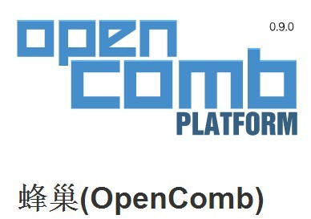
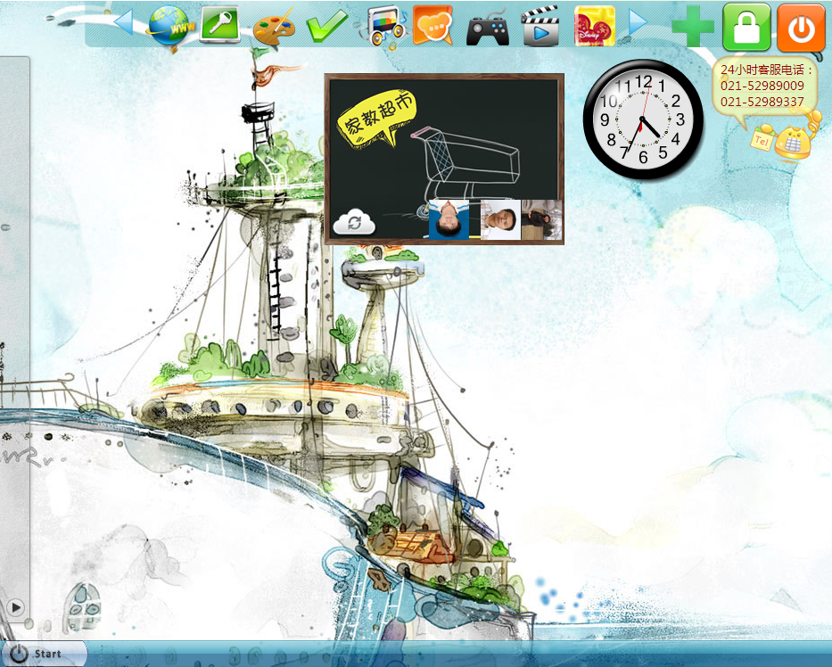
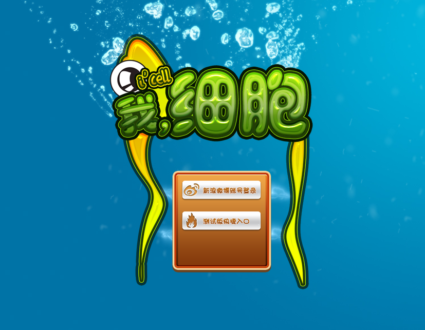

___高俊___（1983-2-28），辽宁大连。

教育：吉林大学自考本科-计算机专业。

经验：9年（PHP Mysql NODEJS Mongodb javascript html5 Flash）

GitHub: https://github.com/aarongao

QQ: 11111199

Email: xiaobug@gmail.com

---

# 专业能力

## Web开发

LAMP 
NODEJS+MONGODB 
UBUNTU CentOS
HTML5  JAVASCRIPT
FLASH

---

# 工作经验

___大连科多网络科技有限公司___
10年8月-13年6月	系统整合、新技术研发。

___中国国际海运网___
08年10月-10年6月	PHP编写及框架扩展。

___大连日联信息技术有限公司___
07年06月---08年10月	需求分析、框架设计、代码编写等工作。

___大连在线互联网信息服务有限公司___
03年11月---07年6月	PHP项目的设计开发。

---

# 主要项目

## 蜂巢(OpenComb)

项目主页：[http://www.opencomb.com](http://www.opencomb.com)

“蜂巢”是一个基于 PHP5.3 实现的深度云计算应用框架。

蜂巢采用了扩展模式，系统中的功能和特性都由扩展提供。

* CMS(内容管理系统)扩展

* 菜单编辑器扩展 - 可以对系统中所有的导航菜单编辑管理

* 语言翻译扩展 - 可以设置语言，并翻译网页中所有出现的文字内容

* OA扩展 - 实现了常用的OA(办公自动化)功能

* OAuth扩展 - 允许用户使用微博,腾讯,人人等多个社交网站的账号登陆，并推送消息到这些社交网站

* 视图编辑扩展 - 该扩展实现了以下高级功能：
	
	* 所有的网页上的视图(view)布局，都过已通过拖拽方式，进行所见即所得的编辑，并保存
	
	* 能够“合并“网页中的视图，生成新网页
	
	* “编织”模板 —— 不是修改模板的源文件，而是将html内容编织到模板的特定位置

* Banner管理

* … …

所有蜂巢的扩展，都是可选安装的，蜂巢框架本身并不提供具体的功能。

## 蜂巢 Node.js 版本

Github主页：[https://github.com/OpenComb/OpenComb](https://github.com/OpenComb/OpenComb)

并且将 蜂巢 for Node.js 中的一些核心子系统，分离成为独立的项目发布

## NodeIM

NodeIM 是一个完全由 JavaScript 实现的即时通讯项目，它包含了完整的服务器端和客户端代码。

* 客户端由Html5（在Qt/WebKit里）实现。

* 服务器端仅仅使用了 Node.js 和 MongoDB。

Github: [https://github.com/aarongao/nodeim]

## 窝内网

[http://www.wonei.com](http://www.wonei.com)

窝内网是一个面向魔兽世界玩家的SNS网站，它早期在网游玩家中拥有广泛的知名度。

窝内网最早基于UCHome 1.5 ，在运营过程中，我们陆续加入了大量的自有代码库。

## 窝特(Wote)

“窝特”是为窝内网开发的桌面软件，谐音“What?”，用来推送窝内网用户的社交动态，类似“人人桌面”。

## 京东(jd.com)数字音乐商城MP3/MP4播放器

[http://music.jd.com] (http://music.jd.com)

参与了京东数字音乐商城项目，所有类型的播放器（MP3播放器，MV视频播放器，试听播放器，付费后的单曲播放器，专辑播放器，以及电台播放器）。

## 真知保护

[http://www.knowledge.com.cn](http://www.knowledge.com.cn)

真知保护是一个客户委托的开发项目，它是一款儿童保护软件，安装到计算机以后，会锁定windows桌面，儿童用户只能访问我们提供的桌面，从而限制和过滤儿童对计算机和互联网的访问。

在真知保护提供的桌面上，我们实现了：浏览器，聊天(及时通讯)，视频，音乐，文件架等常用的系统功能。真知保护和后来的QQ桌面很像。

## 

## I,Cell

《我，细胞》是一个以微生物环境为故事背景的 物理解密+塔防 类型游戏。

玩家会在游戏中扮演显微镜下的一个单细胞生物。你可以控制细胞的移动探索微观世界，搜集氨基酸，躲避或迎击病毒群。

当玩家滚动鼠标滚轮时（或触摸屏幕上的手势），显微镜的观察倍数就会放大，细胞的体内场景逐渐显示出来。你必须在为细胞建造各种器官来提升细胞的能力，以及防御进入到细胞得病毒。

细胞的体内场景就是一个经典的自由布局塔防。

击杀每一关的Boss后，细胞会随机生长，因此你无法完全控制细胞的自然形状。完美击杀Boss会获得DNA奖励，用以细胞的生长和器官的解锁、升级。

《我，细胞》还提供了一个功能完善的关卡编辑器，由玩家来自由编辑关卡。

Github: [https://github.com/JeCat/games-icell] (https://github.com/JeCat/games-icell)

Demo：[http://games.jecat.cn/icell] (http://games.jecat.cn/icell)

## 大连在线人才网（http://www.daliancity.com.cn）
大连本地数一数二的招聘类网站。

## 中国国际海运网（http://www.shippingchina.com）
中国国际海运网是中国最大的海运电子商务网站

## 中日人才交流（http://www.workinjp.com）
## 东企在线（http://www.dongqi.net.cn）

